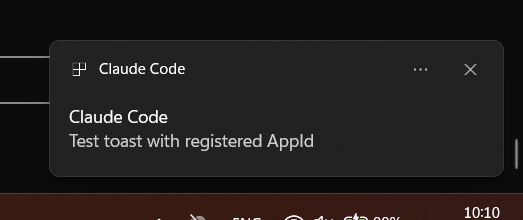

# claude-code-statusline

[](LICENSE)
[](#requirements)
[](#requirements)

Statusline + notification hook for [Claude Code](https://claude.com/claude-code) on Windows.

Tells you at a glance which of your parallel Claude Code windows is busy, idle, or waiting for permission — and surfaces toast notifications when one needs your attention.

---

## Why

When you run several Claude Code sessions in parallel terminals, it's easy to lose track of which one is thinking, which one finished, and which is blocked on a permission prompt. The default TUI doesn't surface that across windows. This adds:

- **A persistent statusline** at the bottom of each Claude Code window with project name, busy indicator, model, context %, rate-limit usage, and elapsed-since-last-activity.
- **A notification hook** that fires distinct sounds and Windows toasts (with project name in the title) when a window wants you.

---

## What it looks like


| Segment       | Meaning                                                                                     |
|---------------|---------------------------------------------------------------------------------------------|
| `project-name`| `session_name` if set, else `cwd` basename. Truncates with `…` to fit terminal width.       |
| `●` / `WAIT`  | Green `●` = session busy. Red `WAIT` = permission prompt pending. Hidden = idle.            |
| `Opus 4.7 1M` | Model display name; `1M` suffix when 1M context is enabled.                                 |
| `13% (131k)`  | Context used: percent + token count. Dim → yellow ≥60 → bold yellow ≥80 → red ≥90.          |
| `5h:19% 7d:48%`| Rate-limit usage (5-hour / 7-day). Dim → yellow → red as it climbs.                        |
| `41s`         | Seconds since the transcript JSONL was last touched. Dim <30s → yellow <2min → red ≥2min. This is your "is it stuck?" signal. |

The notification hook adds:

- **Permission prompt** → warning beep + toast titled `[project] Permission needed`
- **Idle prompt** (turn ended, awaiting input) → chime + toast titled `[project] Awaiting your input`
- **Elicitation dialog** → asterisk beep + toast titled `[project] Question`



---

## Requirements

- Windows 10 or 11
- Python 3.10+ on `PATH`
- Claude Code installed

---

## Install

### Automated (recommended)

```powershell
git clone https://github.com/EranDaniel98/claude-code-statusline.git
cd claude-code-statusline
.\scripts\install.ps1
```

The script:
1. Copies `statusline.py` and `hooks/notify.py` into `~/.claude/` (backing up any existing files).
2. Registers the `Anthropic.ClaudeCode` AppId in the Windows registry (required for toasts to display — Windows silently drops toasts from unregistered AppIds).
3. Prints the JSON snippet you need to merge into `~/.claude/settings.json`.

Then merge the printed snippet into `~/.claude/settings.json` and restart any open Claude Code window.

### Manual

1. Copy files:
   ```powershell
   Copy-Item statusline.py "$env:USERPROFILE\.claude\statusline.py"
   New-Item -ItemType Directory -Force -Path "$env:USERPROFILE\.claude\hooks" | Out-Null
   Copy-Item hooks\notify.py "$env:USERPROFILE\.claude\hooks\notify.py"
   ```

2. Register the toast AppId:
   ```powershell
   .\scripts\register-app-id.ps1
   ```

3. Merge the contents of `settings.example.json` into `~/.claude/settings.json`:
   ```json
   {
     "statusLine": {
       "type": "command",
       "command": "python ~/.claude/statusline.py",
       "refreshInterval": 300
     },
     "hooks": {
       "Notification": [
         { "hooks": [{ "type": "command", "command": "python ~/.claude/hooks/notify.py" }] }
       ]
     }
   }
   ```

4. Restart any open Claude Code window.

---

## Verify

```powershell
# Optionally copy tests into ~/.claude/tests/ — or run them from the repo:
python tests\test_statusline.py    # scripted state matrix; should print "9/9 passed"
python tests\test_notify.py        # fires 3 toasts + 3 sounds
python tests\test_colors.py        # renders the dot/WAIT states
```

Then open a Claude Code window and confirm:
- Green `●` appears between project name and model while Claude is responding.
- Dot disappears within ~1s after the response finishes.

See [`tests/CHECKLIST.md`](tests/CHECKLIST.md) for cross-window scenarios.

---

## Environment variables

| Variable                       | Effect                                                                          |
|--------------------------------|---------------------------------------------------------------------------------|
| `CLAUDE_QUIET=1`               | Silence the notification hook (no sounds, no toasts).                           |
| `CLAUDE_STATUSLINE_DEBUG=1`    | Dump the raw statusline payload to `~/.claude/statusline-payload.json`.         |
| `COLUMNS=N`                    | Force terminal width (otherwise autodetected via `CONOUT$` on Windows).         |

---

## Troubleshooting

**Toasts don't appear (sounds work).** The `Anthropic.ClaudeCode` AppId isn't registered. Run `.\scripts\register-app-id.ps1`. After registration, "Claude Code" appears in **Settings → System → Notifications → Notifications from apps and other senders** — make sure it's toggled on, and that Focus / Do not disturb is off.

**Sounds all sound identical.** Windows' default sound scheme maps Asterisk / Default Beep / Critical Stop to the same `.wav`. Customize the events in **Sound Control Panel → Sounds** if you want distinct audio cues.

**Dot never appears.** Verify Python is on `PATH` and the statusLine command in settings.json points to the right path. Run `python ~/.claude/statusline.py < ~/.claude/statusline-payload.json` (after setting `CLAUDE_STATUSLINE_DEBUG=1` once to generate the payload) to see direct output.

**Project name truncated even on a wide terminal.** Terminal width detection isn't picking up your console. Set `COLUMNS=120` (or whatever your width is) in your shell profile.

---

## Known limitations

- **Sparse refresh during silent work.** Claude Code doesn't fire statusline refreshes on the `refreshInterval` timer reliably during long thinking turns or long tool calls — repaints fire on state events (start/end of turn, permission prompts). The dot accurately reflects state *at the last paint*, not in real time. For "is it stuck?", trust the `elapsed` segment (red at ≥2min) which is more likely to repaint on heartbeat refreshes.
- **Windows-only.** The notification hook uses `winsound` + PowerShell WinRT. `statusline.py` itself is mostly portable, but the terminal-width detection prefers `CONOUT$` on Windows.

---

## Design notes

- **Statusline reads stdin payload** Claude Code provides on every render: session id, transcript path, cwd, model, context window, rate limits.
- **Busy state comes from `~/.claude/sessions/<PID>.json`** — Claude Code's `status` field there is the authoritative liveness signal (`idle` / `busy` / `waiting`).
- **Elapsed is transcript JSONL mtime**, which only updates on message/tool completion (not during silent thinking). This is what makes it a stuck-detector.
- **Toast AppId is registered in `HKCU:\SOFTWARE\Classes\AppUserModelId\Anthropic.ClaudeCode`** — Microsoft's documented way to register a standalone notifier without needing a Start Menu shortcut.

---

## License

MIT — see [LICENSE](LICENSE).
